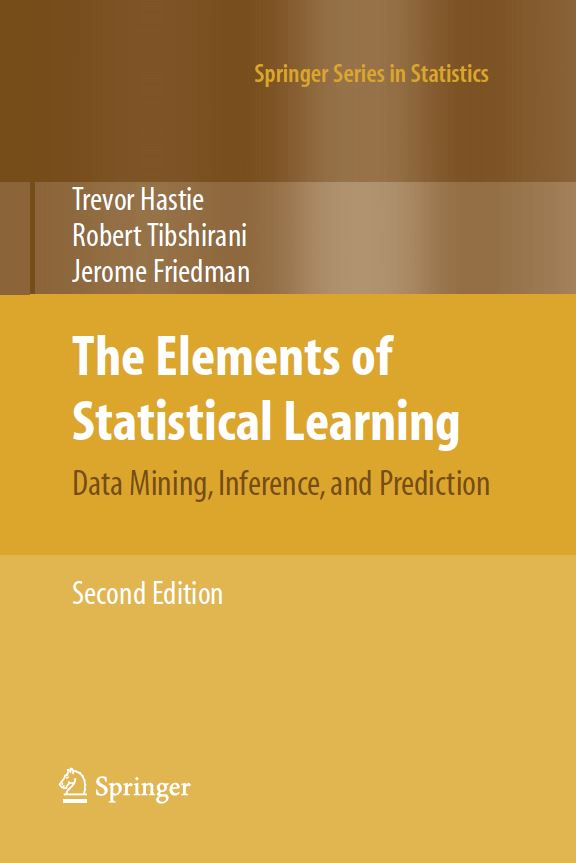

[Back to the Contents](Contents.html)

I would like to say something before all the documents.

Basically all the contents here in this statistical learning zone are based on the book: Trevor Hastie,Robert Tibshirani,Jerome Friedman, **The Elements of Statistical Learning** (Second Edition) Springer. 

{width=300}

After reading the first half of this book, I verified the statement that this book is not suitable for beginners. If you are a beginner at statistcal learning, I suggest do not read this book at first. Instead, choose **Introduction to Statistical Learning**.

Overall, this book (ESL) is great and really worthy of reading for more than one time. It introduces the machine learning methods from a higher viewpoints, so that the readers can understand how the methods are derived and why we need this method rather than others.

When reading it at the first time, it is not very friendly since there are always some terminologies that haven been discussed about appearing suddenly. However, when reading it at the second time, it will be easier to understand!

I sometimes copy the statements from the book directly, just because the original statement is good enough (they are indeed wonderful).

I will update this zone any time!

